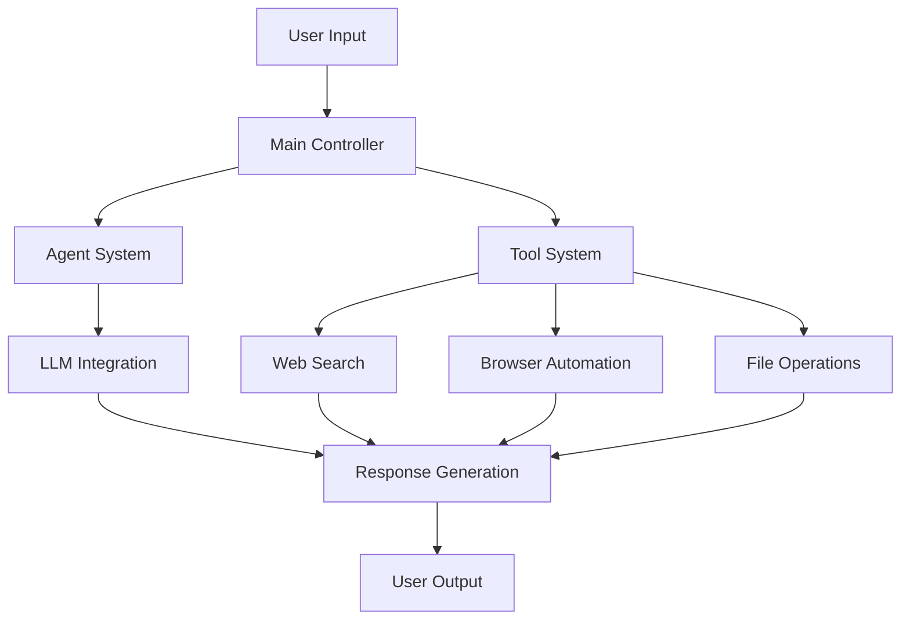

# OpenManus Architecture

This document provides a comprehensive overview of the OpenManus architecture, its core components, and how they interact with each other.

## System Overview

OpenManus is built on a modular architecture that combines several key components:

## Core Components

### 1. Main Controller (`main.py`, `run_mcp.py`, `run_flow.py`)
- Handles user input processing
- Manages the flow of information between components
- Coordinates agent activities
- Located in the root directory

### 2. Agent System (`app/agent/`)
- Implements different specialized agents
- Handles agent communication
- Manages task distribution
- Supports multi-agent collaboration

### 3. Tool System (`app/tool/`)
The tool system provides various capabilities:

#### Web Search (`app/tool/web_search.py`)
- Implements internet search functionality
- Handles multiple search engines
- Processes and filters search results
- Manages rate limiting and API calls

#### Browser Automation (`app/tool/browser_use_tool.py`)
- Provides web page interaction capabilities
- Handles navigation and content extraction
- Manages browser sessions and states

#### File Operations (`app/tool/file_operators.py`)
- Handles file system interactions
- Manages file reading and writing
- Supports various file formats

### 4. LLM Integration (`app/llm.py`)
- Manages communication with language models
- Handles API interactions
- Processes model responses
- Implements retry and error handling

## Data Flow

1. **Input Processing**
   - User input is received through the main controller
   - Input is analyzed and routed to appropriate agents

2. **Agent Processing**
   - Agents process tasks based on their specialization
   - Multiple agents can collaborate on complex tasks
   - Agents use tools as needed

3. **Tool Execution**
   - Tools are called by agents as needed
   - Results are processed and returned to agents
   - Multiple tools can be chained together

4. **Response Generation**
   - Processed information is combined
   - LLM generates appropriate responses
   - Results are formatted for user presentation

## Configuration System

The configuration system (`config/config.toml`) manages:
- API keys and endpoints
- Model settings
- Tool configurations
- Agent parameters

## Extension Points

OpenManus can be extended through:
1. Custom agents in `app/agent/`
2. New tools in `app/tool/`
3. Additional LLM integrations
4. Custom configuration options

## Security Considerations

- API keys are managed through configuration files
- Sensitive operations require user confirmation
- Browser automation is sandboxed
- File operations are restricted to workspace
