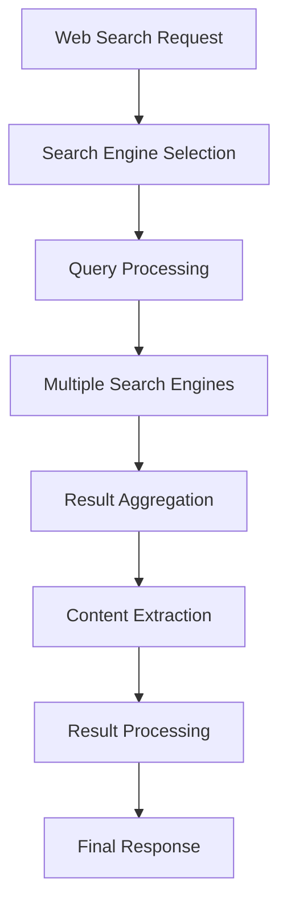

# RAG and Search Capabilities

This document details the Retrieval-Augmented Generation (RAG) system and search capabilities in OpenManus.

## Web Search Implementation

### Overview

The web search system is implemented in `app/tool/web_search.py` and provides comprehensive internet search capabilities. It combines multiple search engines and processing techniques to gather and filter relevant information.

### Key Components



### Search Engine Integration

The system supports multiple search engines:
- Google Search
- DuckDuckGo
- Custom search providers

Each search engine is implemented with:
- Rate limiting
- Error handling
- Result parsing
- Content extraction

### Content Processing

1. **Query Processing**
   - Query normalization
   - Parameter handling
   - Search context integration

2. **Result Processing**
   - Content extraction
   - HTML parsing
   - Text cleaning
   - Relevance ranking

3. **Response Formatting**
   - Structured data creation
   - Context integration
   - Source attribution

## Browser Automation

The browser automation system (`app/tool/browser_use_tool.py`) enhances search capabilities with:

### Features

1. **Page Navigation**
   - URL handling
   - Redirect following
   - State management

2. **Content Extraction**
   - DOM parsing
   - Dynamic content handling
   - JavaScript execution

3. **Interaction Capabilities**
   - Form filling
   - Button clicking
   - Page scrolling

### Implementation Details

```python
# Example browser automation structure
class BrowserTool:
    def navigate(self, url):
        # Handle navigation
        pass

    def extract_content(self, selector):
        # Extract specific content
        pass

    def interact(self, element):
        # Handle interaction
        pass
```

## RAG System Implementation

The RAG system combines search results with LLM capabilities:

### Components

1. **Information Retrieval**
   - Web search results
   - Browser-extracted content
   - Local file content

2. **Content Processing**
   - Text chunking
   - Relevance scoring
   - Context building

3. **Generation Integration**
   - Context injection
   - Response generation
   - Source attribution

### Implementation Example

```python
# Example RAG implementation structure
class RAGSystem:
    def retrieve(self, query):
        # Get relevant information
        pass

    def process_content(self, content):
        # Process and structure content
        pass

    def generate_response(self, query, context):
        # Generate response using LLM
        pass
```

## Usage in Your System

To implement similar capabilities in your system:

### 1. Web Search Integration

```python
from web_search import WebSearchTool

# Initialize search tool
search_tool = WebSearchTool(
    api_keys={
        'google': 'your_api_key',
        'duckduckgo': 'your_api_key'
    }
)

# Perform search
results = search_tool.search('your query')
```

### 2. Browser Automation

```python
from browser_tool import BrowserTool

# Initialize browser
browser = BrowserTool()

# Navigate and extract
content = browser.navigate('url').extract_content()
```

### 3. RAG Implementation

```python
from rag_system import RAGSystem

# Initialize RAG
rag = RAGSystem(
    search_tool=search_tool,
    browser_tool=browser,
    llm_config=llm_config
)

# Generate response
response = rag.process_query('user query')
```

## Best Practices

1. **Search Implementation**
   - Implement rate limiting
   - Handle API errors gracefully
   - Cache common results
   - Validate search parameters

2. **Browser Automation**
   - Use headless mode when possible
   - Implement timeout handling
   - Clean up resources properly
   - Handle JavaScript errors

3. **RAG System**
   - Balance context length
   - Implement relevance scoring
   - Handle source attribution
   - Maintain result quality

## Configuration

Example configuration in `config.toml`:

```toml
[search]
default_engine = "google"
max_results = 10
cache_duration = 3600

[browser]
headless = true
timeout = 30
max_retries = 3

[rag]
context_length = 2048
relevance_threshold = 0.7
```
