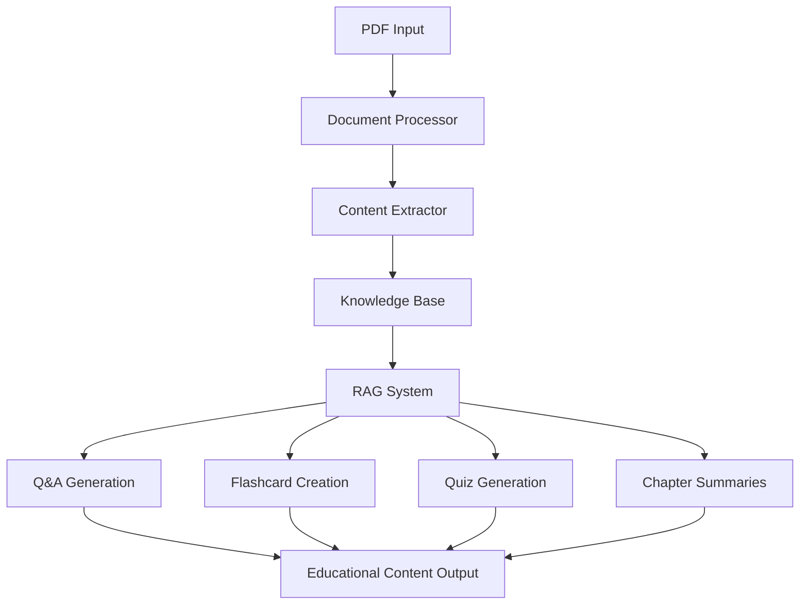

# Educational RAG System Implementation Guide

This guide explains how to adapt OpenManus's RAG and web search capabilities for an educational platform that processes PDFs and generates educational content.

## System Architecture



## Core Components

### 1. Document Processing System

```python
class PDFProcessor:
    def __init__(self):
        self.parser = PDFParser()
        self.chunker = TextChunker()

    def process_pdf(self, pdf_path):
        # Extract text from PDF
        raw_text = self.parser.parse(pdf_path)

        # Split into logical chunks (chapters, sections)
        chunks = self.chunker.split_by_sections(raw_text)

        # Extract metadata (titles, headers, etc.)
        metadata = self.parser.extract_metadata(raw_text)

        return {
            'chunks': chunks,
            'metadata': metadata,
            'structure': self.analyze_structure(chunks)
        }
```

### 2. Knowledge Base System

```python
class EducationalKnowledgeBase:
    def __init__(self):
        self.vector_store = VectorStore()
        self.metadata_store = MetadataStore()

    def index_document(self, processed_doc):
        # Index chunks for semantic search
        vectors = self.vector_store.add_chunks(processed_doc['chunks'])

        # Store metadata and relationships
        self.metadata_store.add_metadata(processed_doc['metadata'])

        # Create chapter relationships
        self.create_relationships(processed_doc['structure'])
```

### 3. Educational RAG System

```python
class EducationalRAG:
    def __init__(self, knowledge_base, llm_config):
        self.kb = knowledge_base
        self.llm = LLMInterface(llm_config)

    def generate_qa(self, context):
        prompt = self.create_qa_prompt(context)
        return self.llm.generate(prompt)

    def create_flashcards(self, context):
        prompt = self.create_flashcard_prompt(context)
        return self.llm.generate(prompt)

    def generate_quiz(self, context):
        prompt = self.create_quiz_prompt(context)
        return self.llm.generate(prompt)

    def create_summary(self, context):
        prompt = self.create_summary_prompt(context)
        return self.llm.generate(prompt)
```

## Implementation Steps

### 1. PDF Processing Setup

```python
# Initialize the PDF processing system
pdf_processor = PDFProcessor()

# Process a PDF document
processed_doc = pdf_processor.process_pdf('textbook.pdf')

# Index the processed document
knowledge_base = EducationalKnowledgeBase()
knowledge_base.index_document(processed_doc)
```

### 2. RAG System Configuration

```python
# Configure the educational RAG system
config = {
    'model': 'gpt-4',
    'temperature': 0.7,
    'max_tokens': 2048
}

rag_system = EducationalRAG(knowledge_base, config)
```

### 3. Content Generation

```python
# Generate different types of educational content
chapter = knowledge_base.get_chapter(1)

# Generate Q&A pairs
qa_pairs = rag_system.generate_qa(chapter)

# Create flashcards
flashcards = rag_system.create_flashcards(chapter)

# Generate a quiz
quiz = rag_system.generate_quiz(chapter)

# Create chapter summary
summary = rag_system.create_summary(chapter)
```

## Prompt Templates

### 1. Q&A Generation

```python
QA_PROMPT_TEMPLATE = """
Given the following educational content:
{context}

Generate {num_questions} question-answer pairs that:
- Cover key concepts
- Vary in difficulty
- Include both factual and conceptual questions
- Follow Bloom's taxonomy levels

Format:
Q1: [Question]
A1: [Detailed answer]
"""
```

### 2. Flashcard Creation

```python
FLASHCARD_PROMPT_TEMPLATE = """
Based on this educational content:
{context}

Create {num_cards} flashcards that:
- Focus on key terms and concepts
- Include clear, concise definitions
- Progress from basic to advanced concepts
- Include examples where appropriate

Format:
Front: [Term/Concept]
Back: [Definition/Explanation]
"""
```

### 3. Quiz Generation

```python
QUIZ_PROMPT_TEMPLATE = """
Using this educational material:
{context}

Create a quiz with {num_questions} questions that:
- Includes multiple choice and open-ended questions
- Covers main concepts and details
- Varies in difficulty
- Provides correct answers and explanations

Format:
Q1: [Question]
Options:
a) [Option]
b) [Option]
c) [Option]
d) [Option]
Correct Answer: [Letter]
Explanation: [Why this is correct]
"""
```

## Configuration Example

```toml
[educational_rag]
# PDF Processing
chunk_size = 1000
overlap = 200
min_chunk_size = 100

# Content Generation
qa_pairs_per_chapter = 10
flashcards_per_concept = 5
quiz_questions_per_section = 8

# LLM Settings
model = "gpt-4"
temperature = 0.7
max_tokens = 2048

# Vector Store
embedding_model = "text-embedding-ada-002"
similarity_threshold = 0.85
```

## Best Practices

1. **PDF Processing**
   - Use OCR for scanned documents
   - Maintain document structure
   - Extract and preserve formatting
   - Handle images and diagrams

2. **Content Generation**
   - Balance quantity and quality
   - Ensure educational value
   - Maintain consistent difficulty levels
   - Include varied question types

3. **System Performance**
   - Cache common queries
   - Batch process documents
   - Optimize vector searches
   - Monitor LLM token usage

## Integration with OpenManus

To integrate this system with OpenManus:

1. **Extend the Tool System**
```python
from openmanus.tool import BaseTool

class EducationalTool(BaseTool):
    def __init__(self):
        self.rag_system = EducationalRAG()

    def process_pdf(self, pdf_path):
        return self.rag_system.process_document(pdf_path)

    def generate_content(self, context, content_type):
        return self.rag_system.generate(context, content_type)
```

2. **Add Custom Agents**
```python
from openmanus.agent import BaseAgent

class EducationalAgent(BaseAgent):
    def __init__(self):
        self.educational_tool = EducationalTool()

    def handle_request(self, request):
        # Process educational requests
        pass
```

3. **Configure the System**
```python
# Add to config.toml
[educational_agent]
enabled = true
tools = ["educational_tool", "web_search", "browser_tool"]
```
