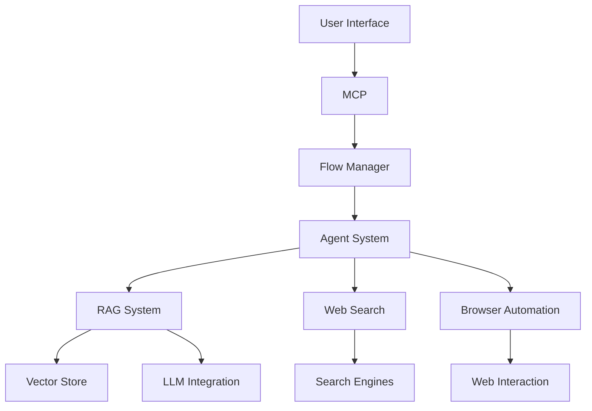

# OpenManus System Overview

This document provides an overview of the original OpenManus system, from which we've extracted the RAG and web search capabilities for the Sentris RAG component.

## Original System Components

### 1. RAG System (Extracted)
- ChromaDB-based vector storage
- Document processing and chunking
- Semantic search capabilities
- LLM integration for content generation
- Token-based text processing

### 2. Web Search (Extracted)
- Multi-engine support (Google, DuckDuckGo)
- Content extraction and cleaning
- Rate limiting and caching
- Result enrichment and ranking

### 3. Agent System (Not Included)
- Multi-agent coordination
- Task planning and execution
- Agent communication protocols
- Role-based agent assignments

### 4. Browser Automation (Not Included)
- Playwright integration
- Web interaction capabilities
- Screenshot and DOM manipulation
- Form filling and navigation

### 5. Flow Management (Not Included)
- Task orchestration
- Workflow definition
- Error handling and recovery
- State management

### 6. MCP (Master Control Program) (Not Included)
- Agent supervision
- Resource allocation
- Task scheduling
- System monitoring

### 7. UI Components (Not Included)
- Web interface
- Real-time updates
- Task visualization
- Progress tracking

## Original Architecture

## Components We've Extracted

We've specifically extracted and adapted:

1. **RAG System**
   - Document processing
   - Vector storage
   - Retrieval mechanisms
   - LLM integration

2. **Web Search**
   - Search engine integration
   - Content processing
   - Result management
   - Caching system

These components were chosen because they provide the core functionality needed for Sentris while maintaining a focused scope.

## Original System Features Not Included

1. **Agent System**
   - Task decomposition
   - Agent collaboration
   - Knowledge sharing
   - Goal planning

2. **Browser Automation**
   - Web scraping
   - Interactive browsing
   - Form automation
   - Site navigation

3. **Flow Management**
   - Process orchestration
   - Error recovery
   - State tracking
   - Event handling

4. **MCP Features**
   - System coordination
   - Resource management
   - Performance monitoring
   - Load balancing

5. **UI Components**
   - User interface
   - Visualization tools
   - Control panels
   - Status displays

## Integration Points

The original OpenManus system had these integration points:

1. **External Services**
   - LLM providers
   - Search engines
   - Knowledge bases
   - Cloud services

2. **Data Flow**
   - Input processing
   - Content transformation
   - Result aggregation
   - Output formatting

3. **Control Flow**
   - Task scheduling
   - Resource allocation
   - Error handling
   - State management

## System Requirements

The original system required:

1. **Hardware**
   - CPU: Multi-core processor
   - RAM: 16GB minimum
   - Storage: SSD recommended
   - GPU: Optional for LLM

2. **Software**
   - Python 3.8+
   - Node.js
   - Browser drivers
   - Database systems

3. **External Services**
   - OpenAI API
   - Search engine APIs
   - Cloud storage
   - Monitoring services

## Conclusion

The OpenManus system was a comprehensive agent-based automation platform. For our purposes, we've extracted the RAG system and web search capabilities, which were well-designed, modular components that can stand alone. These components provide the core functionality needed for the Sentris RAG implementation while maintaining a focused scope.
